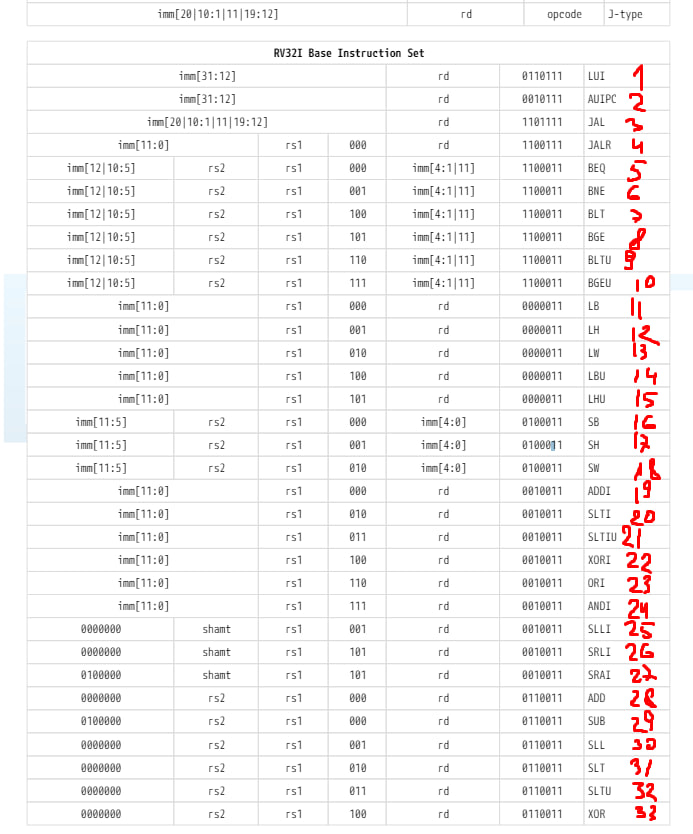
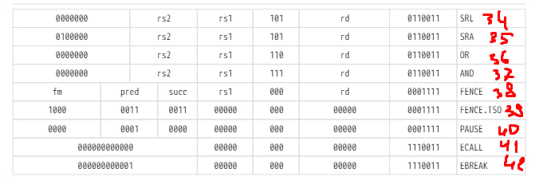

| Лабораторная работа №1 | M31<Группа>                      | АОВС |
| ---------------------- |----------------------------------| ---- |
| Представление чисел    | Лебединский Михаил Станиславович | 2024 |

## Инструментарий
Работа выполняется на C/C++ (C11 и новее / C++20). Архитектура набора команд RISC-V (unpriv-isa-asciidoc.pdf из release-2024-04-18).
## Что реализовано
Вариант 1. Выполнена normal версия

## Результат работы на тестовых данных: [ссылка на последний успешный action с актуальными данными](https://github.com/skkv-itmo-comp-arch/se-comp-arch24-cache-isa-MikhailLebedItmo/actions/runs/9134267836)

# Описание:

## Перевод C в Assembler

Тут ничего хитрого придумано не было.

Цикл реализовывал с помощью blt r1, r2 offset.
Которая проверяет верно ли что r1 < r2. И если это верно то прыгает на offset / 4 команд вперёд. 
В конце тела каждого цикла у меня стоит blt, которая проверяет верно ли условие, и если верно то прыгает в начало цикла(offset у меня отрицательный).

Элементы массива и получаю с помощью команд lb r1 offset r2 (записывает байт из оперативной памяти находящийся
по адресу r2 + offset, в регистр r1) и lw r1 offset r2 (работает аналогично, только считывает 2 байта).

Записываю в элемент массива с помощью sw r1 offset r2 (записывает 4 байта из регистра r1 в ячейки MEM
начинающеюся с адреса r2 + offset)

Все переменные храню в регистрах. Изменяю значения счётчиков и указателей с помощью команд addi r1 r2 imm 
(которая записывает r2 + imm в r1, imm - 12 битное значение(если нужно прибавить большое число, просто несколько 
раз выполняю эту команду)). И add r1 r2 r3 (записывает r2 + r3 в r1)

Умножение выполняю с помощью команды mul r1 r2 r3 (записывает r2 + r3 в r1)

## Перевод Assembler в бинарник
Переводил команды в тупую. В соответствии с документацией.


https://msyksphinz-self.github.io/riscv-isadoc/html/rvm.html


У меня есть класс InstructionEncoder нужный для удобства формирование одной команды (32 бит).
У него есть методы `add_bits(cnt, val)` который добавляет cnt младших битов из val к текущему коду. 
`add_register(reg_name)` который добавляет 5 битов кодирующих регистр reg_name к текущему коду. И метод `get_code()`
который возвращет uint32_t полученный код.

Есть класс. CodeEncoder с конструктором из вектора команд. С методом `encode_all_commands(file_path)`.
Который кодирует все команды и записывает их в file_path.

В нём для каждой команды создан статический метод, который занимается кодированием этой команды(на вход
он получает аргументы команды, на выход возвращает uint32_t - код команды).
Также имеется две статических мапы `CodeEncoder::three_args_instructions`  и `CodeEncoder::two_args_instructions`
(ключ - имя команды, значение - указатель на нужный статический метод).

Все методы перевода команды к её код выглядят примерно одинаково, просто делают то что написано в документации.
Вот пример одного из них.

```cpp
static uint32_t add(EncoderThreeArgsCommandArgs& args) {
        uint32_t code = InstructionEncoder().add_bits(7, 0b0000000).add_register(args.arg_3).add_register(args.arg_2)
                .add_bits(3, 0b000).add_register(args.arg_1).add_bits(7, 0b0110011).get_code();
        return code;
}
```
Метод encode_all_commands

```cpp
void encode_all_commands(const std::filesystem::path& out_file_path) {
        std::ofstream fout(out_file_path, std::ios::binary);
        for (auto& command: commands) {
            uint32_t code;
            if (two_args_instructions.contains(command[0])) {
                EncoderTwoArgsCommandArgs args{command[1], command[2]};
                code = two_args_instructions.at(command[0])(args);
            } else if (three_args_instructions.contains(command[0])) {
                EncoderThreeArgsCommandArgs args{{command[1], command[2]}, command[3]};
                code = three_args_instructions.at(command[0])(args);
            } else {
                std::cerr << "Error: command " << command[0] << " not found" << std::endl;
                exit(-1);
            }
            далее записываем code в fout в little_endian формате
        }
    }
```

## Cache
Есть класс MEM моделирует оперативную память. Просто хранить в себе массив байт. И возвращает 
(1 << offset_len) байт. при запросе чтение какого-то байта(строку в которой лежит этот байт). И записывает 
строку с указанным номером. Это делают методы `read_line` и `write_line` соответственно.

Есть класс LRUCacheLine моделирует одну кэш линию. Хранит в себе tag, position(номер в очереди), и массив с байтами.

Есть класс LRUCacheWay моделирует один блок кэша. Хранит в себе вектор из кэш-линий лежащих в нём.

Есть виртуальный класс Cache предоставляющий интерфейс. С методами `read_1_byte` `read_2_bytes` `read_4_bytes`
`write_1_byte` `write_2_bytes` `write_4_bytes` `get_hit_cnt` `get_request_cnt`

От него унаследованы `LRUCache` и `PLRUCache`

И класс LRUCache моделирует LRU-кэш. Хранит в себе вектор из кэш-блоков.
Помимо публичных методов унаследованных от Cache.
Содержит метод `is_contains(address)` - возвращает true если в кэше есть ячейка с таким адресом.
Метод `update_line(address)` - если нет ячейки в кэше с таким адресом. То удаляет из кэша 
последнюю не использованную линию. И загружает на её место линию из MEM содержащую эту ячейку.
После чего обновляет position нужных линий(запрашиваемой линии присваивает 0, у тех кто были до неё в очереди увеличивает 
position на 1) логика этого реализована в методе update_position LRUCacheBlock. 
Возвращает true если был кэш промах.

```cpp
bool update_line(uint32_t address) {
        if (auto [contains, pos] = is_contains(address); contains) {
            for (auto& way: ways) {
                way.update_position(address, pos);
            }
            return false;
        }
        size_t max_position_ind = 0;
        uint32_t max_position = 0;

        for (int i = 0; i < ways.size(); ++i) {
            auto position = ways[i].get_position(address);
            if (position > max_position) {
                max_position_ind = i;
                max_position = position;
            }
        }

        ways[max_position_ind].update_line(memory, address);
        for (auto& way: ways) {
            way.update_position(address, max_position);
        }

        return true;
}
```

Метод `read_mem_cell(address)` сначала делает update_line(address) после чего, считывает ячейку из кэша. 
Возвращает пару uint8_t(считанный байт) bool(был ли кэш промах)

```cpp
std::pair<uint8_t, bool> read_mem_cell(uint32_t address) {
        bool is_not_hit = update_line(address);
        for (auto& way: ways) {
            if (way.is_contains(address)) {
                return {way.read_mem_cell(address), is_not_hit};
            }
        }
}
```

Метод `write_mem_cell(adress, byte)` сначала делает update_line(address) после чего, записывает ячейку в кэш.
Возвращает пару uint8_t(считанный байт) bool(был ли кэш промах)

```cpp
bool write_mem_cell(uint32_t address, uint8_t value) {
        bool is_not_hit = update_line(address);
        for (auto& way: ways) {
            if (way.is_contains(address)) {
                way.write_mem_cell(address, value);
                return is_not_hit;
            }
        }
}
```

Все публичные методы просто используют их внутри себя.

PLRUCache - реализован точно также(у него методы с теми же названиями).

Только LRUCacheLine хранит вместо position - flag.

И в update_line он использованной строке присваивает flag=true. И если все стали true. 
Присваивает остальным линиям false.

## Interpreter
Есть класс Rigisters с перегруженным оператором [reg_name] возвращающим ссылку на значение регистра.
если reg_name == x0 или zero/ Возвращает ноль.

Есть класс Interpreter с конструктором от кэша и списка команд. Который исполняет полученные команды. 
При запросах к оперативной памяти обращается к кэшу.

В нём для каждой команды есть статический метод, который в тупую делает то что она должна
(все они очень короткие и выглядят примерно одинаков).

Вот несколько из примеров таких методов:
```cpp
static void lw(InterpreterThreeArgsCommandArgs& args) {
        uint32_t address = args.registers[args.arg_3] + expand_12_bit_value(args.arg_2);
        args.registers[args.arg_1] = args.cache.read_4_bytes(address);
        jump(args.registers, args.cur_command, 1);
}
```

```cpp
static void beq(InterpreterThreeArgsCommandArgs& args) {
        if (args.registers[args.arg_1] == args.registers[args.arg_2]) {
            return jump(args.registers, args.cur_command, expand_13_bit_value(args.arg_3) / 4);
        }
        jump(args.registers, args.cur_command, 1);
}
```

Каждая из них внутри себя использует метод jump. Нужный для переходов между командами. Он внутри себя меняет регистр pc
и iterator указывающий на текущую исполняемую комманду.

```cpp
static void jump(Registers& regs, Commands::iterator& cur, int shift) {
        cur += shift;
        regs["pc"] += 4 * shift;
}
```

Также в классе есть две статические мапы `Interpreter::three_args_instructions` и 
`Interpreter::two_args_instructions`. Ключ - имя команды, значение - указатель на соответсвующий метод.

Выполнение всех команд выглядит так: исполняем текущую команду, пока она не станет равна jalr на ra.

```cpp
std::pair<uint32_t, uint32_t> run() {
        while (cur_command->front() != "jalr" || ((*cur_command)[2] != "ra" && (*cur_command)[2] != "x1")) {
            if (cur_command->size() == 3) {
                InterpreterTwoArgsCommandArgs args = {cur_command, registers, cache, (*cur_command)[1], (*cur_command)[2]};
                two_args_instructions.at(cur_command->front())(args);
            } else if (cur_command->size() == 4) {
                InterpreterThreeArgsCommandArgs args{
                        {cur_command, registers, cache, (*cur_command)[1], (*cur_command)[2]}, (*cur_command)[3]
                };
                three_args_instructions.at(cur_command->front())(args);
            }
        }

        return {cache.get_hit_cnt(), cache.get_request_cnt()};
}
```

После исполнения всех команд возвращает пару hit_cnt, request_cnt.


## Расчёт констант 

CACHE_OFFSET_LEN = LOG(CACHE_LINE_SIZE) = LOG(32) = 5

CACHE_IND_LEN = LOG(CACHE_SETS) = LOG(32) = 5

CACHE_TAG_LEN = ADDR_LEN - CACHE_OFFSET_LEN - CACHE_IND_LEN

MEM_SIZE = 2^ADDR_LEN = 2 ** 18

CACHE_SIZE = CACHE_WAY * CACHE_LINE_SIZE * CACHE_SETS = 2^12

CACHE_LINE_COUNT = CACHE_WAY * CACHE_SETS = 2^7


> Раздел, в котором вы описываете свою реализацию:
>
> ISA:
> - как вы делали перевод из C в asm RISC-V, что из спецификации RISC-V вы узнали необходимого для этого. не забываем результат перевода приложить в виде отдельного файла (читаем README.md)
> - как реализован транслятор asm->binary (какие классы/функции писали и зачем)
> Cache:
> - результат расчёта параметров системы (формулы для расчёта, пояснения к вычислениям и какие значения по итогу получились). Все пункты, где было написано "вычислить самостоятельно".
> - какие классы/функции созданы для представления кеша, как реализованы политики вытеснения и конфигурация в целом, как он работает
> Моделирование задачи:
> - результат работы написанной программы (то, что выводится в стандартный поток вывода / файл при разных аргументах командной строки)
> - 
> ... прочее, что считаете полезным описать ...
>
>> Представьте, что вы пришли на защиту, и вам сказали "Рассказывай, что как реализовано".

### Примечания по оформлению (можно удалить после создания отчёта)

1. Не нужно вставлять своё описание как quote (цитату). 
2. Старайтесь также разбивать ваш текст на логические разделы и отделять мысли заголовками.
3. Если хочется вставить фрагменты кода, то делаете это блоком кода. Если же ссылаетесь на код, то рекомендуется это делать через permalink на файлы в репозитории.
4. Можно пользоваться всеми возможностями Github Markdown.
5. Никаких фоток в отчёте, ровно как и скринов полного экрана. Это больно смотреть \(
6. Если вы хотите вставить изображение из сети, то не нужно его грузить в репозиторий.
7. В случае описание подсхем Logisim, если вы просто ссылаетесь на подсхему в целом, то достаточно указать назвнаие подсхемы из проекта. Если же вы описываете какой-то небольшой фрагмент схемы, то лучше его вставить в виде рисунка в отчёт.
